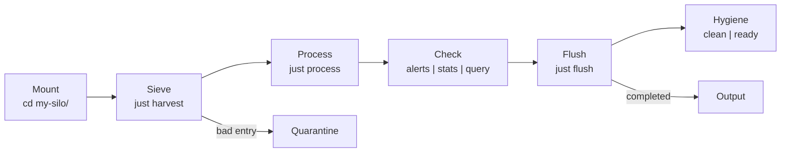

# just-silo

**A directory-based skill pattern for AI agents.**

Mount a silo, and an agent can understand and act on a domain with zero prior context.

```bash
# Quick start
cp -r template my-silo
cd my-silo
just harvest           # Ingest data
just process           # Run domain script
just alerts            # Surface critical items
just flush             # Compact to final output
```

## Prerequisites

- [`just`](https://github.com/casey/just) — Command runner (install: `brew install just`)
- [`jq`](https://github.com/jqlang/jq) — JSON processor (install: `brew install jq`)

Verify:
```bash
just --version   # >= 1.48
jq --version     # >= 1.6
```

## Installation

### Use the template
```bash
cp -r template my-silo
cd my-silo
just verify          # Check prerequisites
just self-test       # Run smoke test
```

### Clone an existing silo
```bash
git clone https://github.com/you/your-silo.git
cd your-silo
just install-deps    # Verify dependencies
just verify          # Check silo integrity
```

## What is a Silo?

A silo is a **deployment unit** containing everything an agent needs to understand and act on a domain:

```
my-silo/
├── .silo              # Manifest (name, version, interface)
├── README.md          # Domain description, critical thresholds
├── schema.json        # Canonical data structure
├── queries.json       # Named jq filters (prevents ad-hoc jq)
├── harvest.jsonl      # Raw input data
├── justfile           # The engine (recipes)
└── process.sh         # Domain script
```

### Key Files

| File | Purpose |
|------|---------|
| `.silo` | Machine-readable manifest |
| `README.md` | Human-readable rules and SOP |
| `schema.json` | JSON Schema for validation |
| `queries.json` | Named jq filters |
| `justfile` | CLI interface (`just --list`) |

## The Workflow



| Step | Command | What it does |
|------|---------|--------------|
| Mount | `cd my-silo/` | Agent discovers rules from README |
| Sieve | `just harvest` | Validates against schema |
| Process | `just process` | Runs domain script |
| Check | `just alerts` | Surfaces critical items |
| Flush | `just flush` | Compacts to final output |

## Recipes

Run `just --list` to see all available recipes.

| Recipe | Purpose |
|--------|---------|
| `just verify` | Confirm silo is mounted |
| `just harvest` | Validate input against schema |
| `just process` | Run domain script |
| `just alerts` | Extract critical alerts |
| `just stats` | Show metrics |
| `just flush` | Compact completed entries |
| `just self-test` | Smoke test |
| `just install-deps` | Check prerequisites |

## Usage Examples

### Single agent
```bash
cd silo_barley
just harvest
just process
just alerts
just flush
```

### Multiple agents (cooperative)
```bash
# Agent A: Stage 1
just claim 1
just harvest
just done 1

# Agent B: Stage 2 (waits for Agent A)
just wait harvest.done
just claim 2
just process
just done 2
```

See [Multi-Agent Patterns](playbooks/playbook-silo.md#multi-agent-patterns) for details.

## Configuration

### Environment variables

| Variable | Default | Purpose |
|----------|---------|---------|
| `AGENT_ID` | `$(hostname)` | Agent identifier for multi-agent |

### Schema validation

Entries that fail schema validation are sent to `quarantine.jsonl`. Run `just stats` to see quarantine count.

## Troubleshooting

### "No justfile found"
Ensure you're in the silo directory:
```bash
pwd   # Should end with /my-silo
ls justfile   # Should exist
```

### "jq: parse error"
Check your JSONL file is valid:
```bash
jq empty harvest.jsonl
```

### Prerequisite errors
Install missing tools:
```bash
brew install just jq
```

## Examples

- [silo_barley](examples/silo_barley/) — Grain elevator moisture monitor

## Resources

| Document | Purpose |
|----------|--------|
| [Playbook](playbooks/playbook-silo.md) | Quick reference for agents |
| [Manual](manual/manual-silo.md) | Detailed why and how |
| [Examples](../examples/silo_barley/) | Working silo |
| [Skills](../skills/) | Agent instructions |

## Compare

| | Claude Skill | just-silo |
|--|--|--|
| Context injection | ✓ | ✓ |
| State management | Manual | Built-in (harvest → flush) |
| No install | ✗ | ✓ |
| Named jq filters | N/A | ✓ |
| Schema validation | N/A | ✓ |
| Multi-agent ready | ✗ | ✓ |

## License

MIT — Use freely, contribute improvements.

## Contributing

1. Create a silo using the template
2. Test with `just self-test`
3. Document your pattern in the playbook
4. Open a PR with improvements
