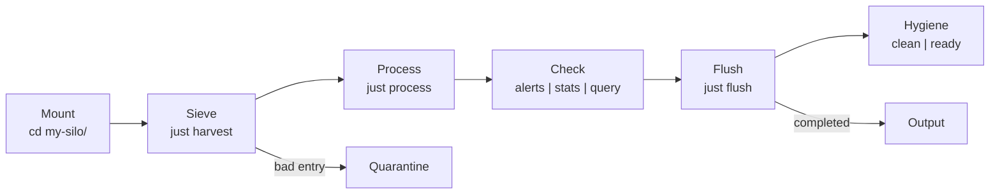

# just-silo

**A directory-based skill pattern for AI agents.**

Mount a silo, and an agent can understand and act on a domain with zero prior context.

## Quick Start

```bash
# Use the template
cp -r template my-silo
cd my-silo
just harvest           # Ingest data
just process           # Run domain script
just alerts            # Surface critical items
just flush             # Compact to final output
```

## What is a Silo?

A silo is a directory containing everything an agent needs to understand and act on a domain:

```
my-silo/
├── .silo              # Manifest (name, version, interface)
├── README.md          # Domain description, critical thresholds
├── schema.json        # Canonical data structure
├── queries.json        # Named jq filters (prevents ad-hoc jq)
├── harvest.jsonl       # Raw input data
├── justfile           # The engine (recipes)
└── process.sh         # Domain script
```

## The Workflow



## Why?

**Cold Start Problem:** Agents typically need extensive prompting to understand a domain.

The Silo pattern externalizes that knowledge into the filesystem. An agent can `cd` into a silo and immediately know what to do via `just --list`.

**Just-in-place deployment:** Don't install capabilities — occupy the territory.

```bash
git clone https://github.com/you/just-silo.git my-silo
cd my-silo
just --list
```

## Examples

- [silo_barley](examples/silo_barley/) — Grain elevator moisture monitor

## Resources

- [Playbook](playbooks/playbook-silo.md) — Patterns, SOPs, anti-patterns

## Compare

| | Claude Skill | just-silo |
|--|--|--|
| Context injection | ✓ | ✓ |
| State management | Manual | Built-in (harvest → flush) |
| No install | ✗ | ✓ |
| Named jq filters | N/A | ✓ |
| Schema validation | N/A | ✓ |
