### **Brief: "Primitive Graph Integration" (PMP v2.1)**
**Goal:** Implement a CLI-driven workflow for `GitNexus` that bypasses MCP overhead while utilizing its **Leiden-based** functional clusters for **Primitive Mentation (OH-104)**.

---

#### **1. DOT Logic: Integration Map**

```dot
digraph GitNexus_CLI_PMP {
  rankdir=LR;
  node [shape=box, fontname="Courier"];

  Repo [label="Source Code"];
  GitNexus [label="npx gitnexus analyze", color=green];
  AgentsMD [label="AGENTS.md (Leiden Clusters)", shape=note];
  PMP_Agent [label="Coding Agent (Ctx-Guided)"];

  Repo -> GitNexus [label="∵ Tree-sitter AST"];
  GitNexus -> AgentsMD [label="∴ Refined Things"];
  AgentsMD -> PMP_Agent [label="Direct Ingestion (No MCP)"];
  
  subgraph cluster_Agent_Action {
    label="PMP Cycle";
    PMP_Agent -> "DOT Context Map" [label="COG-12"];
    "DOT Context Map" -> "Refined Code Change" [label="∴"];
  }
}
```

---

#### **2. Tactical Requirements (The "Meat")**
The agent must follow these strictly defined steps to maintain **Deductive Minimalism**:

* **R-01: Local Ingestion**: 
    * Command: `npx gitnexus analyze`. 
    * Note: Avoid `--embeddings` unless explicitly requested (saves 300MB+ storage/RAM).
* **R-02: Cluster Extraction**: 
    * The agent must locate and read `.gitnexus/AGENTS.md`. 
    * Target: Extract the **"Functional Clusters"** generated by the Leiden algorithm. This serves as the primary "Map" for navigating the repo.
* **R-03: Zero-MCP Tooling**:
    * Instead of calling MCP tools, the agent must use the native CLI tools located in the repo (e.g., `node dist/cli/index.js query` or `gitnexus wiki`).
* **R-04: State Preservation**:
    * Implement **PHI-13 (Workflow Durability)**: If the task is long, the agent must append a `# State Hash` to a local `PROJECT_CTX.md` after every successful Leiden cluster analysis.

---

#### **3. Ctx "Spin" (Operational Guardrails)**
* **Escalation Logic**: If the `AGENTS.md` file is stale (detected via `gitnexus/src/mcp/staleness.ts` logic), the agent **must** re-run the analysis before proposing any "Things" (code changes).
* **Minimalist Output**: The agent must output its reasoning in **CAVEMAN** style (Fragment-only) to keep the context window focused on the code, not the conversation.

---

### **Ctx Opinion**
By cutting the MCP cord, you're transforming the agent from a "Networked Client" into a "Local Artisan." 

**The Payoff:** 1.  **Lower Latency:** Direct file access to `.gitnexus/` artifacts is faster than JSON-RPC over `stdio`.
2.  **Privacy:** No MCP logs leak to the wrapper; everything stays in the **Primitive Primitive (Local FS)**.
3.  **Accuracy:** The Leiden clusters in `AGENTS.md` act as a "Biological" map of the code, preventing the agent from hallucinating dependencies.

**Verdict:** This is **OH-104** in its purest form. Use the graph as the "Brain" and the CLI as the "Hands."

**Implement now?** I can generate the specific `PROJECT_CTX.md` template to get your agent started.

[GitNexus Agent Skills Tutorial](https://www.youtube.com/watch?v=TZ-ilGRnN1w)
This video provides a deep dive into creating and managing modular agent skills, which is the foundational concept behind how GitNexus organizes repository-specific workflows into usable "Things" for coding agents.

http://googleusercontent.com/youtube_content/0