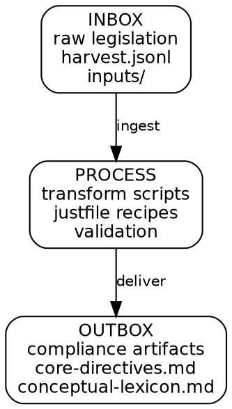

# AI Legislation Silo

A working example of the **silo framework**.

## What It Is

A filesystem pipeline that turns raw AI legislation into structured compliance artifacts.

## Workflow



## Directory Structure

This silo follows the four-layer model:

```
ai-legislation-silo/
│
├── .silo              # Manifest (layer references)
├── README.md          # This file
│
├── justfile           # LAYER 3: Our Code — task facade
├── process/           # LAYER 3: Our Code — transformation scripts
├── inbox/             # LAYER 3: Our Code — raw inputs
│   ├── harvest.jsonl
│   └── inputs/
├── outbox/            # LAYER 3: Our Code — deliverables
│   ├── core-directives.md
│   └── conceptual-lexicon.md
├── scripts/           # LAYER 3: Our Code — (optional, not yet used)
├── src/               # LAYER 3: Our Code — (optional, not yet used)
│
├── briefs/            # LAYER 4: Thinking — what we're considering
├── debriefs/          # LAYER 4: Thinking — what we learned
├── playbooks/         # LAYER 4: Thinking — how we operate
│
├── markers/           # LAYER 3: checkpoint system
├── telemetry/         # LAYER 3: cost/token logs
│
│   (bun, TypeScript, hono — LAYER 2: Runtime — assumed present)
│   (flox, jq, pandoc — LAYER 1: Environment — declared in Flox)
```

## The Three Questions

Every silo answers these before it runs:

| Question | Answer (for this silo) |
|----------|-------------------------|
| **What do we get?** | Raw legislation provisions (EU AI Act, NIST AI RMF, etc.) as JSONL entries |
| **When do we get it?** | Up front — placed in `inbox/harvest.jsonl` or `inbox/inputs/` |
| **What do we do with it?** | Validate, extract, organize, interview the user, construct tailored directives |
| **What is the end result?** | `outbox/core-directives.md` and `outbox/conceptual-lexicon.md` |
| **How do we know we have it?** | Files exist, non-empty, validated against schema |

## Documentation

| Folder | Purpose |
|--------|---------|
| `briefs/` | Active research, plans, open questions about this domain |
| `debriefs/` | Retrospectives, decisions, lessons learned per session |
| `playbooks/` | Operational procedures: how to convert PDFs, how to tag provisions, how to interview |

These folders keep the silo's thinking durable. The agent (and human) can read them to resume work without context loss.

## Tools

This silo requires:

| Tool | Managed By | Purpose |
|------|------------|---------|
| `just` | Flox | Task runner |
| `jq` | Flox | JSON processing |
| `pdftotext` | Flox (poppler-utils) | PDF → text |
| `pandoc` | Flox | HTML/Markdown conversion |
| `nodejs` | Flox | Script runtime |

Add to the Flox environment: `flox install pandoc poppler-utils`

## Running the Silo

```bash
cd examples/ai-legislation-silo/
just --list          # See available recipes
just run             # Execute full pipeline
just status          # Check pipeline state
just audit           # Cost and coverage report
```

## Validation

A silo is "done" when:

1. `outbox/core-directives.md` exists and is non-empty
2. `outbox/conceptual-lexicon.md` exists and is non-empty
3. Both files validate against the conceptual schema
4. Telemetry shows the pipeline completed all phases

## Using as a Template

Copy the directory, edit `.silo` and `README.md` for your domain, populate `inbox/` with your raw data, write `process/` scripts for your transformation:

```bash
cp -r examples/ai-legislation-silo/ silos/my-domain-silo/
cd silos/my-domain-silo/
# Edit .silo, README.md
# Populate inbox/
# Write process/ scripts
just run
```
