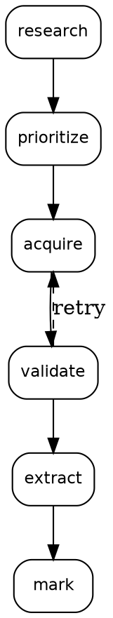

# Acquisition Pipeline

Systematic, restartable acquisition of AI legislative documents.

## Pipeline



## Status Machine

| Status | Meaning | Next |
|--------|---------|------|
| `pending` | Identified, not acquired | `just acquire <id>` |
| `downloaded` | File present | `just validate <id>` |
| `valid` | Hash verified | `just extract <id>` |
| `extracted` | In harvest.jsonl | `just mark <id> done` |
| `done` | Complete | — |
| `failed` | Download/validation error | Review, retry, skip |

## Idempotency

- `just acquire <id>` — skips if file exists and hash unchanged
- `just validate <id>` — recomputes hash, updates status
- `just extract <id>` — replaces existing entries in harvest.jsonl (deduplicated by source id)
- `just mark <id> done` — no-op if already marked

## Commands

```bash
just acquire <id>      # Download
just validate <id>   # Check integrity
just extract <id>     # Convert to JSONL
just mark <id> done   # Record completion
just pipeline-run     # Auto-resume all pending
just status           # Show all states
```

## State File

`markers/acquisition-state.jsonl` — append-only:

```jsonl
{"timestamp":"2026-04-26T10:00:00Z","doc_id":"eu-ai-act-2024-1689","action":"acquire","status":"downloaded","size_bytes":2847200}
{"timestamp":"2026-04-26T10:01:00Z","doc_id":"eu-ai-act-2024-1689","action":"validate","status":"valid","sha256":"a1b2c3..."}
```

## File Storage

```
inbox/raw/
├── eu-ai-act-2024-1689.pdf
├── eu-ai-act-2024-1689.sha256
└── eu-ai-act-2024-1689.status
```
