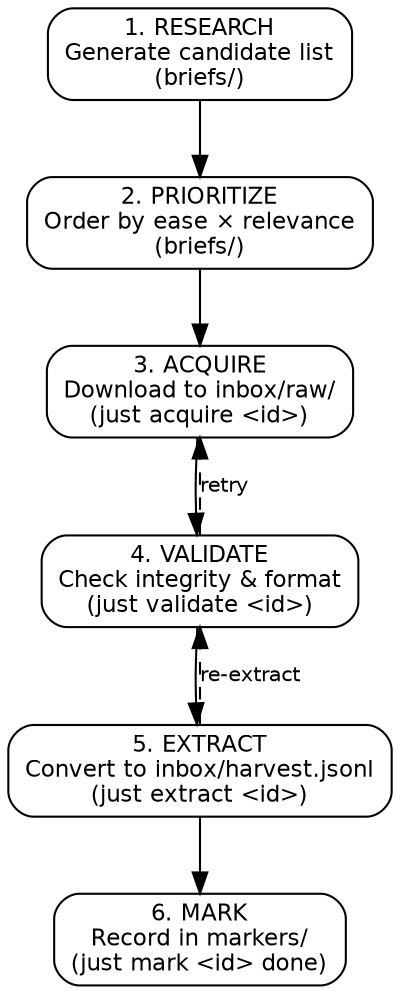

# Acquisition Pipeline Playbook

## Purpose
Systematic, restartable, idempotent acquisition of AI legislative documents.

## Pipeline Shape



## Idempotency Rules

### File Storage
```
inbox/raw/
├── eu-ai-act-2024-1689.pdf        # Original filename preserved
├── eu-ai-act-2024-1689.sha256     # Integrity hash
├── eu-ai-act-2024-1689.status     # acquisition state
├── uk-ai-whitepaper-2023.pdf
├── uk-ai-whitepaper-2023.sha256
├── uk-ai-whitepaper-2023.status
└── ...
```

### Status Values
| Status | Meaning | Next Action |
|--------|---------|-------------|
| `pending` | Identified, not yet acquired | `just acquire <id>` |
| `downloaded` | File present, not validated | `just validate <id>` |
| `valid` | Hash verified, format ok | `just extract <id>` |
| `extracted` | In harvest.jsonl | `just mark <id> done` |
| `done` | Complete, in pipeline | — |
| `failed` | Download/validation failed | Review, retry, or skip |
| `skipped` | Consciously excluded | — |

### Idempotency Guarantees
- Running `just acquire <id>` twice: skips if file exists and hash unchanged
- Running `just validate <id>` twice: recomputes hash, updates status
- Running `just extract <id>` twice: replaces existing entries in harvest.jsonl (deduplicated by source id)
- Running `just mark <id> done` twice: no-op if already marked

## Commands

```bash
# Full pipeline for one document
just acquire eu-ai-act-2024-1689   # Download
just validate eu-ai-act-2024-1689  # Check integrity
just extract eu-ai-act-2024-1689   # Convert to JSONL
just mark eu-ai-act-2024-1689 done # Record completion

# Resume from any point
just status                          # Show all documents and states
just acquire-all                     # Acquire all pending
just validate-all                    # Validate all downloaded
just extract-all                     # Extract all valid

# Pipeline run (respects existing states, idempotent)
just pipeline-run                    # Execute all phases for all pending/ready documents
```

## Pipeline State File

`markers/acquisition-state.jsonl` — append-only log:

```jsonl
{"timestamp":"2026-04-26T10:00:00Z","doc_id":"eu-ai-act-2024-1689","action":"acquire","status":"downloaded","size_bytes":2847200}
{"timestamp":"2026-04-26T10:01:00Z","doc_id":"eu-ai-act-2024-1689","action":"validate","status":"valid","sha256":"a1b2c3..."}
{"timestamp":"2026-04-26T10:02:00Z","doc_id":"eu-ai-act-2024-1689","action":"extract","status":"extracted","provisions":284}
{"timestamp":"2026-04-26T10:03:00Z","doc_id":"eu-ai-act-2024-1689","action":"mark","status":"done"}
```

## Restart Protocol

If the pipeline stops mid-run:

1. `just status` — see what completed and what didn't
2. Resume from the last successful phase:
   - If `downloaded` → run `just validate <id>`
   - If `valid` → run `just extract <id>`
   - If `extracted` → run `just mark <id> done`
3. `just pipeline-run` — auto-resumes all incomplete documents

## Evolution

This playbook is not final. As we acquire documents, we learn:
- Which sources block curl (→ need alternative)
- Which formats parse poorly (→ need different tools)
- Which documents are not actually AI-relevant (→ skip criteria)

Updates go in `briefs/` (open questions) and `debriefs/` (lessons learned). The playbook is revised when patterns stabilize.
