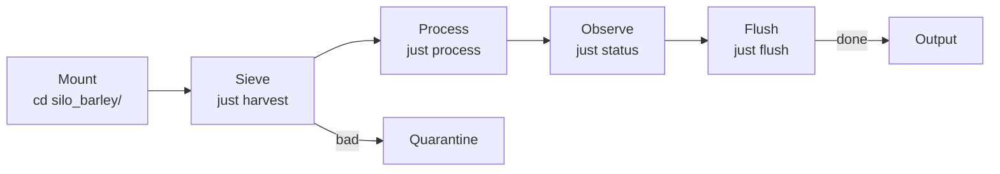

# Silo Barley — Grain Elevator Moisture Monitor

**Example silo:** A working domain-specific data processing pipeline.

## What it does

Tracks moisture levels from grain elevator sensors. Critical alert threshold: **moisture > 15%**.

## Quick Start

```bash
cd examples/silo_barley/
just verify
just harvest
just process
just flush
```

## Workflow

```
Mount → Sieve → Process → Observe → Flush
```

| Step | Command | Purpose |
|------|---------|---------|
| Mount | `cd silo_barley/` | Agent reads rules |
| Sieve | `just harvest` | Validate data |
| Process | `just process` | Run processing |
| Observe | `just status` | Monitor pipeline |
| Flush | `just flush` | Archive output |

## Observe the Territory

**This is the seriously cool part.** Your pipeline IS your dashboard:

```bash
just status          # Complete pipeline health
just who             # Which agents on which stages
just stages          # Stage-by-stage status
just stuck 60        # Stages idle > 60 minutes
just throughput      # Processing metrics
just audit           # Completion history
```

Example output:
```
═══════════════════════════════════════════════════════
  PIPELINE STATUS
═══════════════════════════════════════════════════════
  AGENTS:
  harvest: sensor_harvester
  process: processor
  flush: archiver

  STAGES:
  harvest: DONE (32m ago)
  process: RUNNING

  THROUGHPUT:
  Active: 15
  Quarantined: 0
  Archived: 0

  STUCK (> 60m):
  (none)

  CRITICAL ALERTS (moisture > 15):
  {"elevator_id":"E4","moisture":18.2,...}
  ...
═══════════════════════════════════════════════════════
```

## Files

| File | Purpose |
|------|---------|
| `.silo` | Manifest |
| `pipeline.json` | Stage definitions |
| `schema.json` | Validates `{timestamp, elevator_id, moisture}` |
| `queries.json` | Named jq filters |
| `harvest.jsonl` | 15 test entries (7 critical) |
| `process_harvest.sh` | Marks entries as processed |
| `justfile` | All recipes including observability |
| `scripts/` | Status scripts (stages, stuck, throughput, audit) |
| `markers/` | Agent coordination markers |

## Mermaid



## Test Output

```
$ just harvest
15 entries → data.jsonl, 0 quarantined

$ just status
═══════════════════════════════════════════════════════
  PIPELINE STATUS
═══════════════════════════════════════════════════════
  AGENTS:
  harvest: sensor_harvester
  ...
```

## Multi-Agent Example

```bash
# Agent A: harvest stage
just claim harvest
just harvest
just done harvest

# Agent B: process stage
just wait harvest
just claim process
just process
just done process

# Agent C: monitor from anywhere
cd silo_barley/
just status  # See what's happening
```
