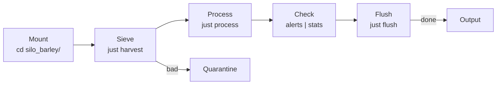

# Silo Barley — Grain Elevator Moisture Monitor

**Example silo:** A working domain-specific data processing pipeline.

## What it does

Tracks moisture levels from grain elevator sensors. Critical alert threshold: **moisture > 15%**.

## Quick Start

```bash
cd examples/silo_barley/
just verify
just harvest
just process
just alerts
just flush
```

## Files

| File | Purpose |
|------|---------|
| `.silo` | Manifest |
| `schema.json` | Validates `{timestamp, elevator_id, moisture}` |
| `queries.json` | Named jq filters |
| `harvest.jsonl` | 15 test entries (7 critical) |
| `process_harvest.sh` | Marks entries as processed |
| `justfile` | All recipes including coordination |

## Workflow

```
Mount → Sieve → Process → Check → Flush
```

## Mermaid



## Test Output

```
$ just harvest
15 entries → data.jsonl, 0 quarantined

$ just alerts
7 critical alerts (moisture > 15)

$ just flush
data.jsonl → 0, final_output.jsonl → 15
```
