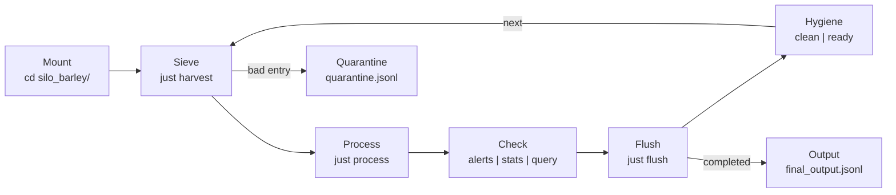

# Silo Barley — Grain Elevator Sensor Monitor

## Purpose
Tracks moisture levels from grain elevator sensors. Critical alert threshold:
**moisture > 15%** must be flagged immediately.

## Silo Anatomy
| File | Role |
|------|------|
| `schema.json` | Defines the canonical JSON entry structure |
| `queries.json` | Named `jq` filters — the "Context Shield" |
| `harvest.jsonl` | Raw sensor readings — the "Substrate" |
| `process_harvest.sh` | Appends `status: processed` to each entry |
| `data.jsonl` | Active processing state (created by `just harvest`) |
| `quarantine.jsonl` | Entries that failed schema validation |
| `final_output.jsonl` | Compacted results after `just flush` |
| `.silo` | Silo manifest / metadata |

## Engine Interface (`just`)
```bash
just --list          # Discover available recipes
just verify         # Confirm silo is mounted and schema is present
just harvest         # Run the harvest pipeline on harvest.jsonl
just stats           # Print silo metrics
just flush           # Compact completed items to final_output.jsonl
just self-test       # Smoke-test the silo
just install-deps    # Ensure required tools (jq, just) are available
```

## Workflow (The Handshake)



| Step | Command | Output |
|------|---------|--------|
| Mount | `cd silo_barley/` | Agent reads README, discovers rules |
| Sieve | `just harvest` | Validates against schema |
| Process | `just process` | Marks entries as processed |
| Check | `just alerts/stats/query` | Surfaces critical items |
| Flush | `just flush` | Moves to final_output.jsonl |
| Hygiene | `just clean` | Resets for next harvest |

## Alert Protocol
> **CRITICAL:** Any entry with `moisture > 15` triggers a high-priority alert.
> Use `jq -c 'select(.moisture > 15)' data.jsonl` to surface alerts at any time.
